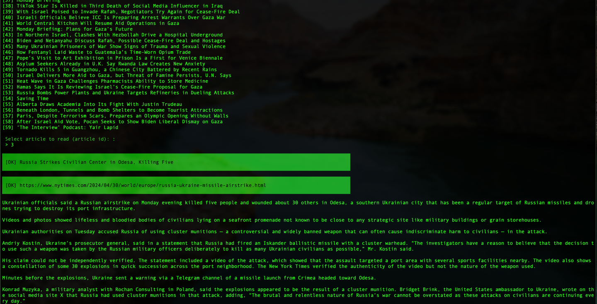

# Console app to read news
#### (Just for fun project)

This is console application (Based on Symfony command package) that works with RSS reader and use custom parser.

Allows to read content of news (without media files) inside shell.

Currently works with `New York Times` only.



## Install

```shell
composer install
```

## Usage

```shell
bin/console nyt:reader
```